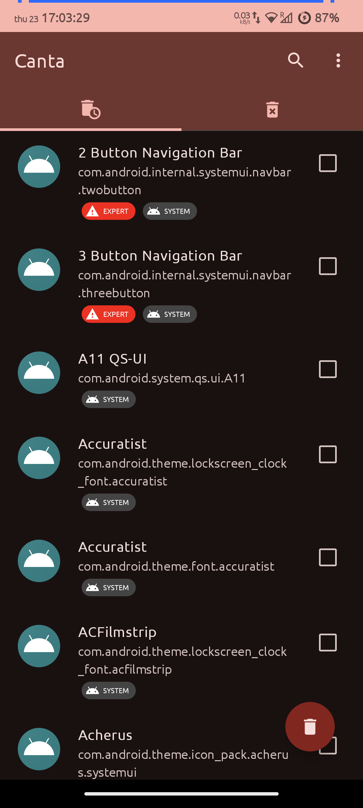
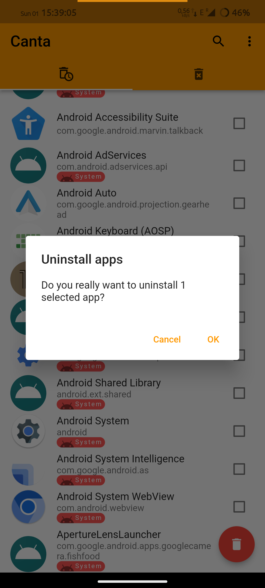

# Canta

Uninstall any app without root!
Powered by [Shizuku](https://shizuku.rikka.app/).

Uses [universal debloat list](https://github.com/Universal-Debloater-Alliance/universal-android-debloater-next-generation/)
for badges.
Please read the guide
on [how recommendations are chosen](https://github.com/Universal-Debloater-Alliance/universal-android-debloater-next-generation/wiki/FAQ#how-are-the-recommendations-chosen)
.

**Note**: Supports only Android >= 9.0 (SDK >= 28).

## How-to

* install [Shizuku](https://play.google.com/store/apps/details?id=moe.shizuku.privileged.api)
  & [activate it](https://shizuku.rikka.app/guide/setup/)
    * you can
      follow [this Android Police guide for more in-depth explanation](https://www.androidpolice.com/how-to-use-shizuku-for-adb-rootless-mods-on-any-android-device/)
* install Canta
* select an app and click the trash button

## Features

* no bricking - though if you remove essential
  app and get stuck in a bootloop after reboot - you will still need to do factory reset!
* auto detect previously uninstalled apps
  if you've already removed any using adb

## Screenshots

## Thanks

* Icon created on [icon kitchen](https://icon.kitchen)
* @RikkaApps for Shizuku
